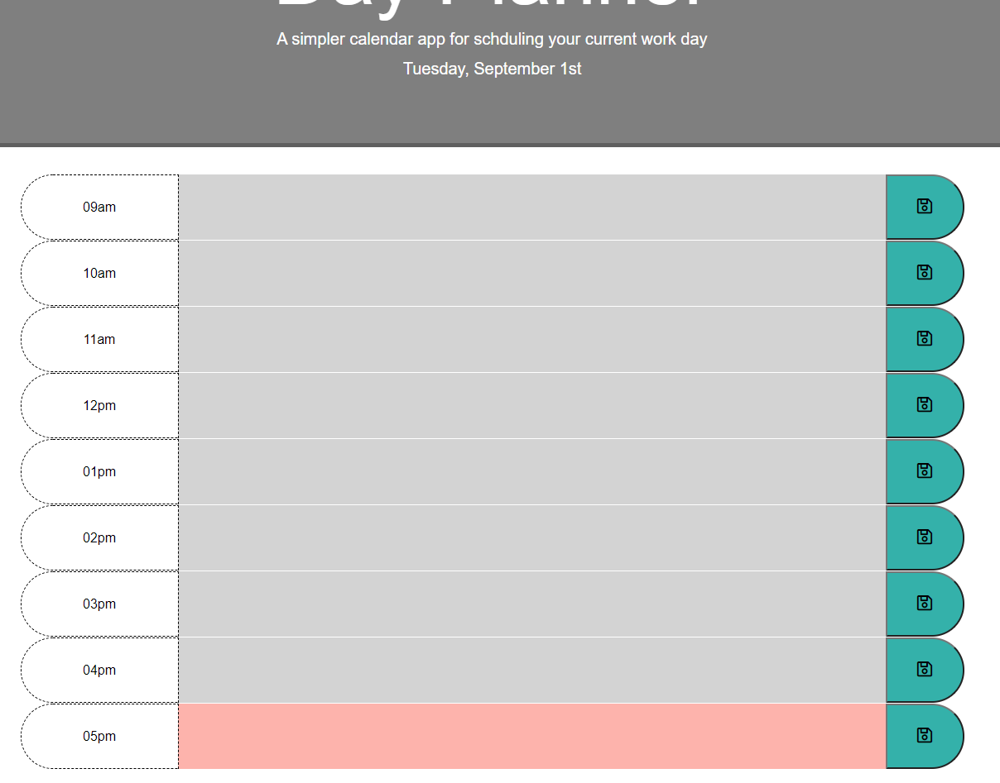
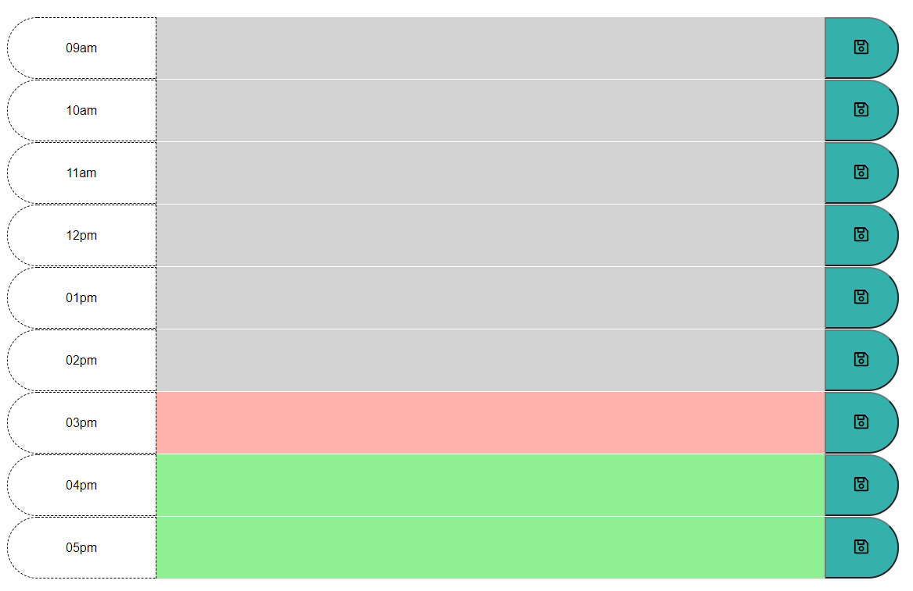
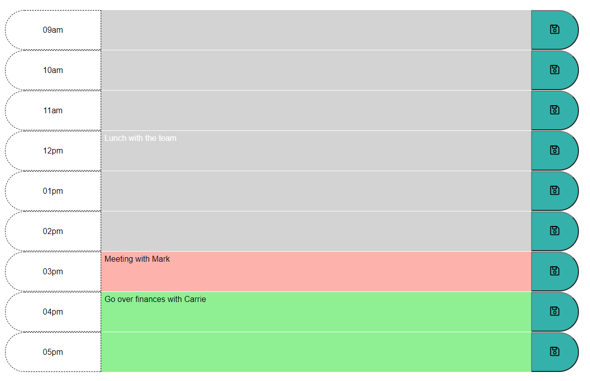

# Day Planner

Root folder contains:
* README.md      (Read Me File)
* index.html     (Day Planner Page)
* \assets\       (CSS and Images Folder)
*   \js\        (Folder that hold the javascript.js file)
*   \css\       (Folder that holds CSS)
*   \images\     (Folder that holds the image files)

## Description
A workday planner that allows you to save daily tasks by the hour. Enter your task and click the save button to store your task into the planner.

## Usage
* Page will generate 9 Rows that will count by hours from 9am to 5pm (normal work day)
* Each row will be provided its time slot along with a text area for the user to input their notes for the hour
* Each row will also be provided a save button that will save information provided in the text area (even when pages is refreshed) if text area is shadded red or green
* If shaded grey (past hours), the text typed in the text area will not be saved.
* Data will stay in text area even if hours have past and the box turns grey.

## Features
* Text Area Color Meaning:
* ---Red = Current hour
* ---Green = Hours to come
* ---Grey = Hours that have past

## Visuals
<a href="https://bbrintle.github.io/5-Day-Planner/">Visit Site</a>
 

## Resources Used
Javascript
 
JQuery
 
HTML/CSS

## Authors
This was created by Blake Brintle. 
 
blakebrintle@gmail.com
 
<a href="https://bbrintle.github.io/">Blake's Site</a>

## License
* MIT

- - -